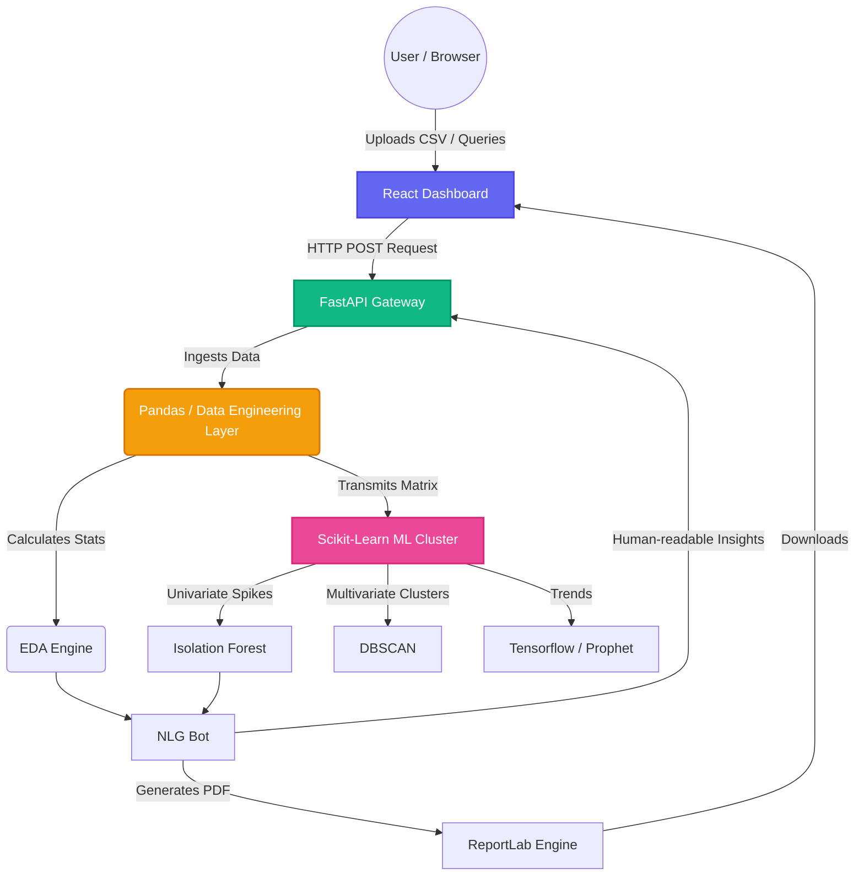

# Intelligent Business Analytics Platform

An advanced, end-to-end analytics engine and dashboard built to extract deep insights from raw datasets. Handles structural data ingestion, performs automated Exploratory Data Analysis, and utilizes machine learning for complex anomaly detection and time-series forecasting.

## System Architecture

## Running the Platform
Navigate to the frontend to launch the React App:
`npm run dev`

Navigate to the backend to launch the API:
`uvicorn main:app --reload`
